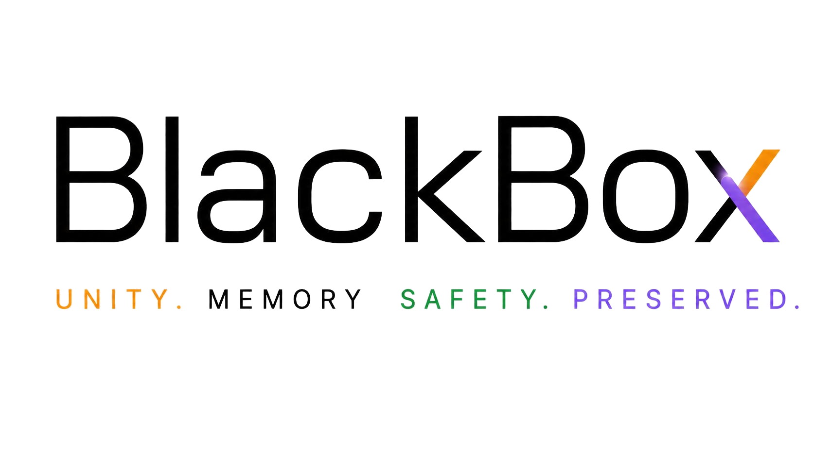

<p align="center">
  
</p>

<h1 align="center">Black Boxx</h1>
<p align="center"><em>Preserve your truth. Understand the pattern. Reach support.</em></p>

<p align="center">
  
  
  
  
  
  
</p>

---

## What is Black Boxx?

Black Boxx is named after airplane flight recorders built to survive pressure and tell the truth afterward.

Black Boxx is a personal safety documentation app that helps people record, preserve, and make sense of unsafe incidents, including police encounters, harassment, workplace discrimination, boundary violations, coercion, and other moments where someone may need a clear record of what happened.

When something unsafe happens, a user can open Black Boxx, start recording, add notes and scenario tags, and let a multi-agent AI pipeline generate a structured, trauma-aware analysis along with matched support resources — so they are never left alone with what just happened.

> **AI helps you preserve the truth, understand the pattern, and reach support without being left alone after something unsafe happens.**

**Built for Blackathon as an AI-track project. The demo narration was produced using [ElevenLabs](https://elevenlabs.io) AI voice generation.**

---

## Why Black Boxx Exists

For too long, our voices have been muted, our stories have been hidden, and our light has been dimmed by hands that are not our own.

Black Boxx is about preservation. It is about community protection. It is about giving people a way to hold onto their own truth — especially in moments where they may feel pressured, dismissed, unsafe, or unsure of what just happened.

This app is not about surveillance. It is not about replacing emergency services, legal support, therapy, or community care.

It is about helping the user keep a record for themselves, in their own words, for their own understanding and safety.

---

## The Problem

Unsafe situations are not always obvious in the moment.

Sometimes harm sounds like pressure. Sometimes coercion sounds like joking. Sometimes a person knows something feels wrong but does not have the words for it yet. Sometimes the most important details are lost because the person is scared, overwhelmed, or trying to stay calm.

Black Boxx helps preserve those details before they disappear.

---

## Core Features

| Feature | Description |
|---|---|
| **Session Recording** | One-tap audio recording via the browser's native `MediaRecorder` API with iOS Safari fallback support |
| **Discreet Mode** | A low-profile experience that swaps the UI to a neutral "Daily Notes" screen while recording continues underneath — designed for moments where openly documenting may increase risk |
| **Quick Exit** | A fast way to leave the screen when privacy or safety matters |
| **Incident Reflection** | AI-supported summaries that help the user understand what happened without minimizing their experience |
| **Pattern Detection** | Identifies possible coercive, dismissive, pressuring, or escalating language patterns |
| **Send Signal (Kinfolk)** | Instant alert to a trusted contact with name, timestamp, and a custom message |
| **Truth Preservation** | The core record centers the user's experience, not outside interpretation |
| **Curated Resource Database** | 30+ pre-vetted organizations across 9 safety categories — never hallucinated by AI |
| **Safety-First Framing** | The app encourages support-seeking without pretending to replace professionals, emergency resources, or legal guidance |

---

## How AI Is Used

Black Boxx uses AI as a support layer, not as the authority.

The AI helps with:

- Summarizing what happened in plain language
- Identifying concerning patterns in the interaction
- Separating facts from emotional interpretation
- Helping the user reflect without self-blame
- Suggesting next steps for support and safety

**The user's truth stays at the center.**

AI does not decide whether something "counts" as harm. Instead, it helps the user understand what was preserved and what patterns may be present. All language uses "possible" and "may suggest" — never conclusions.

---

## Demo Scenario

For the hackathon demo, Black Boxx uses a fictional mock incident to show how the app works.

**Scene:** Party / Consent / Coercion  
**Characters:** Nia and Caleb  
**Context:** Nia feels uncomfortable during a party conversation. Caleb applies pressure, dismisses her discomfort, and guilt-trips her.  
**Purpose:** To demonstrate how Black Boxx can preserve context, detect coercive patterns, and help the user understand what happened afterward.

This scene is fictional and non-graphic. It was created only for demo purposes.  
**Demo audio was generated using [ElevenLabs](https://elevenlabs.io) AI voice synthesis.**

---

## Safety Principles

### User-Centered
The app is mainly for the user's own understanding, reflection, and record keeping.

### Privacy-Aware
The experience is designed with discretion in mind — including Discreet Mode, Quick Exit, and low-profile interaction patterns. All data is stored locally in the user's browser with no server database.

### Non-Replacement
Black Boxx does not replace emergency services, legal advice, therapy, crisis support, or trusted community care.

### Trauma-Aware
The language avoids blaming the user or forcing them to label their experience before they are ready. AI output uses plain language, "possible" framing, and never issues diagnostic conclusions.

### Community-Rooted
The app recognizes that safety is not only individual. Support systems matter, and trusted people can be part of the healing and protection process.

---

## Tech Stack

### Frontend

| Library | Version | Role |
|---|---|---|
| [React](https://react.dev) | 18.3.1 | UI framework and component state |
| [React Router DOM](https://reactrouter.com) | 6.30.1 | Client-side routing |
| [Vite](https://vitejs.dev) | 5.4.10 | Build tool and dev server |
| [Tailwind CSS](https://tailwindcss.com) | 4.1.4 | Utility-first styling |
| [@tailwindcss/vite](https://tailwindcss.com/docs/installation/using-vite) | 4.1.4 | Tailwind Vite plugin |
| [@vitejs/plugin-react](https://github.com/vitejs/vite-plugin-react) | 4.3.4 | React Fast Refresh for Vite |

### Backend / AI

| Library | Version | Role |
|---|---|---|
| [OpenAI Node SDK](https://github.com/openai/openai-node) | 4.104.0 | Access to GPT-4o and GPT-4o-mini |
| [Vercel Node Runtime](https://vercel.com/docs/functions/runtimes/node-js) | @vercel/node@3.2.26 | Serverless function host for the agent pipeline |
| [Node.js](https://nodejs.org) | 22.x | Server runtime |

### Media & Voice

| Service | Role |
|---|---|
| [ElevenLabs](https://elevenlabs.io) | AI voice generation used to produce the app's demo narration |
| Browser `MediaRecorder` API | Native audio capture; format auto-detection (`audio/webm` → `audio/mp4` fallback) |

### Fonts (via Google Fonts CDN)

| Font | Use |
|---|---|
| [Syne](https://fonts.google.com/specimen/Syne) | Display headings |
| [DM Sans](https://fonts.google.com/specimen/DM+Sans) | Body and UI text |
| [DM Mono](https://fonts.google.com/specimen/DM+Mono) | Timers, durations, monospace |

---

## Architecture Overview

```
Browser (React SPA)
│
├── SessionContext          Global recording state — lives above UI layer
│   └── useRecorder         MediaRecorder abstraction + iOS fixes
│
├── Screens / Components    React Router pages
│
└── orchestrator.js         Client: POST /api/reflect with session payload
        │
        ▼
Vercel Serverless Function  /api/reflect.js
        │
        ├── KeywordAgent    (gpt-4o-mini)  Rule-based + LLM phrase detection
        │
        ├── ResourceAgent   (gpt-4o-mini)  Selects 3–4 orgs from static list
        │
        ├── ReflectionAgent (gpt-4o)       Synthesizes 8-field JSON reflection
        │
        └── Fallback        Returns safe minimal reflection on any failure
```

**Key architectural decisions:**

- `OPENAI_API_KEY` has no `VITE_` prefix — it is server-side only, never bundled into the client
- `SessionContext` sits above the router so recording state survives Discreet mode's full-screen overlay
- All 30+ support organizations are hardcoded in `src/data/resources.js` — the ResourceAgent *selects* from this list; it never generates org data, eliminating hallucination risk
- `localStorage` is used for all session persistence — no backend database, users own their data locally
- Every agent failure path returns `buildFallbackReflection()` — no blank screens in a crisis moment

---

## Key User Flow

1. User enters Black Boxx
2. User can activate Discreet documentation mode
3. A session is captured or a demo incident is uploaded
4. AI analyzes the interaction for summary and pattern detection
5. The app presents a user-centered reflection
6. User can review what happened, save the record, or reach trusted support
7. Quick Exit is available at any point for safety and privacy

---

## Agent Pipeline

The pipeline runs inside a single Vercel serverless function (`api/reflect.js`) and processes the session payload sequentially through three specialized agents.

### 1. KeywordAgent — `gpt-4o-mini`

**Pass 1 (free):** Rule-based scan of user notes against `KEYWORD_CATEGORIES` — 10 scenario buckets with curated phrase lists covering police encounters, workplace harm, relationship safety, stalking, digital abuse, and more.

**Pass 2 (LLM):** Validates detected phrases, assigns urgency levels (`immediate` / `elevated` / `informational`), and surfaces whether the session requires an immediate signal.

```js
// Output shape
{
  categories: ["Police Encounter", "Medical Concern"],
  flaggedPhrases: [
    { phrase: "excessive force", category: "Police Encounter", urgency: "elevated" }
  ],
  requiresImmediateSignal: false
}
```

Temperature: `0.2` | Max tokens: `800`

---

### 2. ResourceAgent — `gpt-4o-mini`

Receives the concern categories and selects 3–4 of the most relevant organizations from `src/data/resources.js`. The LLM output is post-filtered against the authoritative list — any org not in the static data is discarded before it reaches the user.

```js
// Output shape
{
  resources: [
    { name: "RAINN", category: "Boundary / Consent Concern", description: "...", url: "https://www.rainn.org" }
  ]
}
```

Temperature: `0.1` | Max tokens: `1200`

---

### 3. ReflectionAgent — `gpt-4o`

Full-context synthesis. Receives notes, transcript, tags, flagged phrases, matched resources, and session metadata. Returns an 8-field `AIReflection` object.

```js
// Output shape
{
  summary: string,                    // 2–4 sentence account in user's words
  timeline: [{ time, event }],        // chronological event reconstruction
  concernAreas: string[],             // e.g. ["Police Encounter"]
  whyFlagged: [{ area, reason, phrases }],
  whatThisDoesNotMean: string,        // standardized guardrail block
  nextSteps: string[],                // 3–5 actionable suggestions
  supportOptions: [{ name, category, description, url }],
  affirmingMessage: string            // warm, specific, never generic
}
```

Temperature: `0.3` | Max tokens: `2000`

System prompt is explicit: not a lawyer, not a therapist, not a judge. All language uses "possible" and "may suggest." Plain language, trauma-aware framing throughout.

---

### Fallback Handler

If any agent throws — missing API key, network failure, malformed JSON — `buildFallbackReflection()` returns a minimal but valid `AIReflection`. The user sees a message acknowledging the issue and still gets generic next steps and general support resources. The app never crashes at the moment it is needed most.

---

## File Structure

```
black-box/
├── api/
│   └── reflect.js                  Vercel serverless entry point; orchestrates all agents
│
├── src/
│   ├── main.jsx                    React root
│   ├── App.jsx                     Router + SessionProvider wrapper
│   ├── index.css                   Global styles + Tailwind base
│   │
│   ├── agents/
│   │   ├── orchestrator.js         Client: calls /api/reflect, handles response
│   │   ├── keywordAgent.js         Server: rule-based + LLM concern detection
│   │   ├── resourceAgent.js        Server: selects resources from static list
│   │   ├── reflectionAgent.js      Server: full session synthesis
│   │   ├── fallback.js             Shared: safe fallback reflection builder
│   │   └── keywords.js             Phrase lists for 10 concern categories
│   │
│   ├── context/
│   │   └── SessionContext.jsx      Global recording state, audio blob management
│   │
│   ├── hooks/
│   │   └── useRecorder.js          MediaRecorder abstraction + iOS format fallback
│   │
│   ├── screens/
│   │   ├── Welcome.jsx / Landing.jsx       Hero, pillars, mission
│   │   ├── KinfolkSetup.jsx / Kinfolk.jsx  Trusted contact setup + management
│   │   ├── Home.jsx                        Main hub
│   │   ├── ActiveSession.jsx               Recording UI (timer, Send Signal, Discreet)
│   │   ├── Discreet.jsx                    Neutral "Daily Notes" overlay
│   │   ├── EndSession.jsx                  Notes + scenario tags form
│   │   ├── ReflectionLoading.jsx           4-step progress while agents run
│   │   ├── SessionReflection.jsx           Renders the 8-section AIReflection
│   │   ├── ReflectionView.jsx              Router wrapper for SessionReflection
│   │   ├── PrivateTimeline.jsx             Session list with tag filter
│   │   └── SupportOptions.jsx             Curated resource browser
│   │
│   ├── components/
│   │   ├── Guardrail.jsx                   Legal/AI/recording-law disclaimer block
│   │   ├── SignalButton.jsx                Alert modal + toast confirmation
│   │   ├── ResourceCard.jsx                Support org display card with link
│   │   ├── AffirmingMessage.jsx            Warm closing message
│   │   ├── TagPicker.jsx                   Scenario tag selector
│   │   └── RecordingAwarenessOverlay.jsx   5-second informational overlay on record start
│   │
│   └── data/
│       └── resources.js                    30 curated orgs across 9 safety categories
│
├── public/
│   └── images/                     Logos and brand assets
│
├── vercel.json                     Pins @vercel/node@3.2.26 for ESM support
├── vite.config.js                  Vite + React + Tailwind plugins
├── tailwind.config.js              Custom color tokens (Unity Cube palette)
└── package.json
```

---

## Design System

### Color Palette (Unity Cube)

| Token | Hex | Use |
|---|---|---|
| `void-black` | `#0A0A0A` | Page background |
| `slate-black` | `#14161B` | Card base |
| `silver-white` | `#E6E6E8` | Primary text |
| `unity-amber` | `#FF9800` | Action, CTA |
| `memory-violet` | `#7B5CFF` | Agency, reflection |
| `safety-green` | `#5CFFB2` | Success state |
| `neutral-gray` | `#6B6F76` | Muted text |
| `alert-red` | `#C0392B` | Danger, urgency |

### Layout
- Mobile-first, responsive at 640px / 768px / 1024px
- Page max-width: 1050px (centered)
- Minimum touch target: 48px height
- Border radius: 12px (controls), 16px (cards)

---

## Screens & Navigation

| Route | Screen | Notes |
|---|---|---|
| `/` | Welcome / Landing | Hero, pillars, mission statement |
| `/setup` | KinfolkSetup | First-run trusted contact entry |
| `/kinfolk` | Kinfolk | Manage all trusted contacts |
| `/home` | Home | Main hub |
| `/session` | ActiveSession | Recording; Discreet overlay lives here |
| `/end` | EndSession | Notes + tags; triggers agent pipeline |
| `/reflecting` | ReflectionLoading | 4-step progress bar (15–30s) |
| `/reflection` | ReflectionView | Full AIReflection display |
| `/timeline` | PrivateTimeline | Session list with tag filter |
| `/support` | SupportOptions | Curated resource browser |

---

## Support Resources

The app includes 30+ pre-vetted organizations across 9 categories. These are never generated by AI — the model selects from this authoritative list only.

| Category | Example Organizations |
|---|---|
| Police Encounter | ACLU, NAACP LDF, Campaign Zero |
| Workplace Concern | EEOC, NELP, A Better Balance |
| Relationship Safety | National DV Hotline, loveisrespect, Black Women's Blueprint |
| Boundary / Consent Concern | RAINN, NSVRC, End Rape on Campus |
| Public Harassment | Hollaback!, Stop AAPI Hate, ADL |
| Stalking / Unwanted Contact | Coalition Against Stalkerware, SPARC, Safety Net |
| Digital Safety | Cyber Civil Rights Initiative, EFF, DDF |
| Exploitation / Restricted Movement | Polaris Project, GEMS, Freedom Network |
| Medical Concern | Crisis Text Line, NAMI, Patient Advocate Foundation |

---

## Getting Started

### Prerequisites
- Node.js 22.x
- A [Vercel account](https://vercel.com) (free tier)
- An [OpenAI API key](https://platform.openai.com/api-keys)

### Local Setup

```bash
git clone <repo-url>
cd black-box
npm install

# Set up Vercel (first time only)
vercel login
vercel link

# Configure environment
echo 'OPENAI_API_KEY="sk-..."' > .env.local

# Start dev server (React + serverless functions)
vercel dev
```

App will be available at `http://localhost:3000`.

> **Important:** Do not use the `VITE_` prefix on `OPENAI_API_KEY`. It must remain server-side only.

### Production Deployment

```bash
vercel --prod
```

Add `OPENAI_API_KEY` in the Vercel dashboard under **Project → Settings → Environment Variables** before deploying.

### Build

```bash
npm run build    # Outputs to dist/
```

---

## Environment Variables

| Variable | Location | Required | Notes |
|---|---|---|---|
| `OPENAI_API_KEY` | Vercel dashboard / `.env.local` | Yes | Server-side only — no `VITE_` prefix |

---

## Security

- **API key** is never bundled into the client — no `VITE_` prefix enforced
- **User data** lives in `localStorage` (browser sandbox) — no server database, no third-party telemetry
- **Resource data** is hardcoded and post-validated — AI cannot hallucinate organization names or URLs
- **HTTPS only** — enforced by Vercel on all deployments
- **Input handling** — session notes and transcripts are treated as plain strings throughout the pipeline
- **Liability** — recording law warnings, AI limitation notices, and "this is not legal advice" disclaimers are visible on every relevant screen

---

## Roadmap

| Feature | Status |
|---|---|
| Audio transcription (Whisper API) | V2 |
| Real SMS alerts (Twilio) | V2 |
| Email alerts (Resend) | V2 |
| Secure encrypted storage | V2 |
| User-controlled export options | V2 |
| File hashing for record integrity | V2 |
| Expanded Kinfolk support flow | V2 |
| Safer resource routing by user needs | V2 |
| Photo / document attachments | V2 |
| Location-aware resource matching | V2 |
| Multi-language support | V2 |
| Optional timeline building | V2 |
| Stronger privacy controls | V2 |
| Offline-first safety mode | V2 |
| More trauma-informed reflection prompts | V2 |
| WCAG 2.1 accessibility audit | V2 |
| Native iOS / Android app | V3 |

---

## Credits & Attribution

| Contributor | Role |
|---|---|
| **OpenAI GPT-4o / GPT-4o-mini** | AI reflection, concern detection, resource matching |
| **[ElevenLabs](https://elevenlabs.io)** | AI voice generation for demo narration |
| **[Vercel](https://vercel.com)** | Serverless hosting and deployment |
| **[React](https://react.dev)** | UI framework |
| **[Tailwind CSS](https://tailwindcss.com)** | Styling system |
| **[Vite](https://vitejs.dev)** | Build tooling |

---

## Disclaimer

Black Boxx is a prototype created for hackathon and demo purposes. It is not a replacement for emergency services, professional legal advice, therapy, medical support, or crisis intervention.

If someone is in immediate danger, they should contact emergency services or a trusted local crisis resource.

---

## License

This project was built for Blackathon as an AI-track project focused on truth, safety, and community protection.  
License: TBD — contact the team before use in production.

---

<p align="center">
  <em>Because your story should not disappear after something unsafe happens.</em>
</p>
